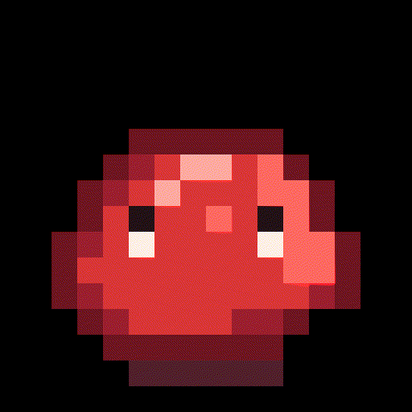
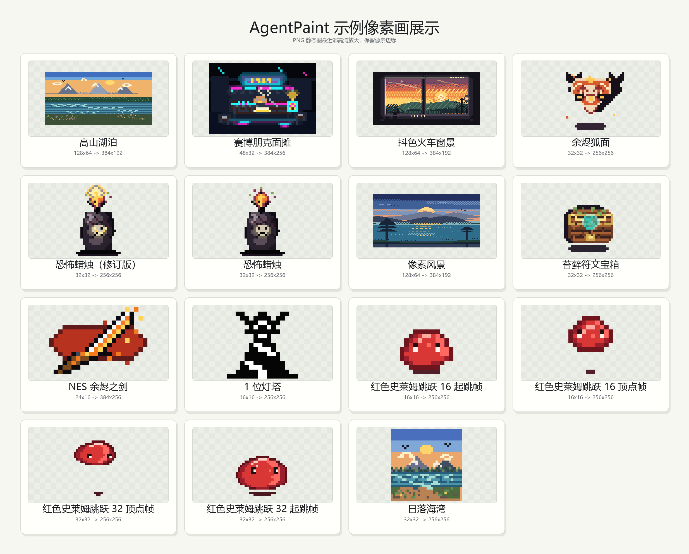

<p align="center">
  
</p>

<h1 align="center">AgentPaint</h1>

<p align="center">
  A Rust CLI, APX/APXA pixel-art format, and cross-agent Skill for LLM-friendly exact-size pixel art.
</p>

<p align="center">
  <a href="docs/README.zh-CN.md">中文文档</a>
  ·
  <a href="docs/install.md">Install</a>
  ·
  <a href="docs/install.zh-CN.md">中文安装</a>
  ·
  <a href="docs/examples.md">Examples</a>
  ·
  <a href="docs/skill-compatibility.md">Skill Compatibility</a>
</p>

The slime above is a transparent `16x16` APXA animation rendered at the exact source size, then point-upscaled to `512x512` only for README display. AgentPaint keeps artwork dimensions exact; previews are separate inspection assets.

## What It Is

AgentPaint gives coding agents a practical way to create pixel art without writing raw RGBA arrays.

- `agentpaint`: a Rust CLI for validation, import, rendering, patching, animation, previews, PSD export, and RGBA export.
- `APX`: a JSON pixel-art source format with palette symbols, text rows, local chunks, and Photoshop-style top-to-bottom layers.
- `APXA`: an animation format that reuses APX layers and applies frame-local patch operations before GIF export.
- `agent-paint-pixel-skills`: a portable `SKILL.md` workflow that tells compatible CLI/IDE agents how to author APX/APXA files and call the installed CLI from `PATH`.

The installed Skill does not need this source repository at runtime. It should write APX/APXA files in the current workspace and call `agentpaint` from `PATH`.

## Generated Examples

<p align="center">
  
</p>

The example sources live in [examples](examples). Rendered PNG/GIF files are generated artifacts, except for README showcase files that are intentionally tracked.

## Quick Install

Install the CLI and the default universal/Codex-compatible Skill:

```bash
sh ./scripts/install.sh --update-path
```

Windows PowerShell:

```powershell
.\scripts\install.ps1 -UpdatePath
```

Verify:

```bash
agentpaint --help
```

For other CLI/IDE agents, install only the Skill to a target:

```bash
sh ./scripts/install.sh --skip-cli --skill-target claude-code
sh ./scripts/install.sh --skip-cli --skill-target cursor --project-skills
sh ./scripts/install.sh --skip-cli --all-skill-targets
```

Windows PowerShell:

```powershell
.\scripts\install.ps1 -SkipCli -SkillTargets claude-code
.\scripts\install.ps1 -SkipCli -ProjectSkills -SkillTargets cursor
.\scripts\install.ps1 -SkipCli -AllSkillTargets
```

See [docs/install.md](docs/install.md) or [docs/install.zh-CN.md](docs/install.zh-CN.md) for paths, supported targets, and update steps.

## CLI Usage

```bash
agentpaint validate <file.apx>
agentpaint inspect <file.apx>
agentpaint import-image <file.png> --out <file.apx>
agentpaint render <file.apx> --out <file.png>
agentpaint supersample <file.apx> --out <file-preview.png>
agentpaint patch <file.apx> --patch <patch.json> --out <patched.apx>
agentpaint export-rgba <file.apx> --out <file.rgba.json>
agentpaint export-psd <file.apx> --out <file.psd>

agentpaint validate-animation <file.apxa>
agentpaint import-gif <file.gif> --out <file.apxa>
agentpaint inspect-animation <file.apxa>
agentpaint render-frame <file.apxa> --frame 0 --out <frame.png>
agentpaint supersample-frame <file.apxa> --frame 0 --out <frame-preview.png>
agentpaint render-gif <file.apxa> --out <file.gif>
```

`import-image` converts an existing raster image to a single-layer APX project without resizing. `import-gif` converts an existing GIF to APXA frames, preserving the source frame dimensions and durations. Both commands assign single-character palette symbols automatically.

Layer order matches Photoshop: `layers[0]` is the visual top/front layer, and the last layer is the visual bottom/back layer. PSD export preserves layer names, top-to-bottom order, visibility, opacity, and palette alpha.

For visual inspection, use `supersample` or `supersample-frame` and inspect the point-upscaled preview instead of the raw low-resolution render. Supersampling uses integer nearest-neighbor scaling and never changes the APX/APXA source dimensions.

GIF export uses the GIF format's practical transparency model. Fully transparent pixels stay transparent, but partial alpha such as soft shadows is quantized during GIF encoding; use PNG frames or APX/APXA source when semi-transparent pixels matter.

## APX Example

```json
{
  "canvas": { "width": 4, "height": 4 },
  "background": "#dfe8c8",
  "palette": {
    ".": "transparent",
    "K": "#171717",
    "R": "#d93636"
  },
  "layers": [
    {
      "name": "paint",
      "rows": [
        "_",
        "_RR_",
        "_KK_",
        "_"
      ]
    }
  ]
}
```

Rules to remember:

- `.` is always transparent.
- `_` is reserved and must not be defined in `palette`.
- Without top-level `background`, `_` renders transparent.
- With top-level `background`, `_` renders as that background color.
- A full-canvas row that is exactly `"_"` expands to the full canvas width.

Full schemas:

- [schemas/apx-v0.schema.json](schemas/apx-v0.schema.json)
- [schemas/apx-patch-v0.schema.json](schemas/apx-patch-v0.schema.json)
- [schemas/apxa-v0.schema.json](schemas/apxa-v0.schema.json)

## Agent Skill

Source Skill:

```text
.agents/skills/agent-paint-pixel-skills
```

Distribution Skill mirror:

```text
skills/agent-paint-pixel-skills
```

Invoke it from a compatible agent:

```text
Use $agent-paint-pixel-skills to generate a 32x32 layered APX sprite, validate it, render it, and create a point-upscaled preview for inspection.
```

Supported installer targets include `universal`/`codex`, `claude-code`, `copilot`, `gemini`, `kiro`, `cline`, `roo-code`, `kilo-code`, `factory`, `goose`, `opencode`, `antigravity`, `cursor`, `windsurf`, `trae`, and `junie`.

Plugin/distribution metadata:

```text
.codex-plugin/plugin.json
.claude-plugin/plugin.json
.claude-plugin/marketplace.json
skill.json
```

## Documentation

- [中文项目指南](docs/README.zh-CN.md)
- [中文安装指南](docs/install.zh-CN.md)
- [Install AgentPaint CLI And Skills](docs/install.md)
- [APX/APXA CLI + Skill Spec](docs/agentpaint-cli-skill-spec.md)
- [LLM Pixel-Art Format Notes](docs/llm-pixel-art-format.md)
- [Pixel-Art Style Research](docs/pixel-art-style-research.md)
- [Skill Compatibility](docs/skill-compatibility.md)
- [Examples](docs/examples.md)

## Development

From this repository, `cargo run -- <command>` is equivalent to running the installed `agentpaint` binary:

```bash
cargo run -- validate examples/one-bit-lighthouse-16.apx
cargo test
cargo fmt --check
```

## License

MIT. See [LICENSE](LICENSE).
